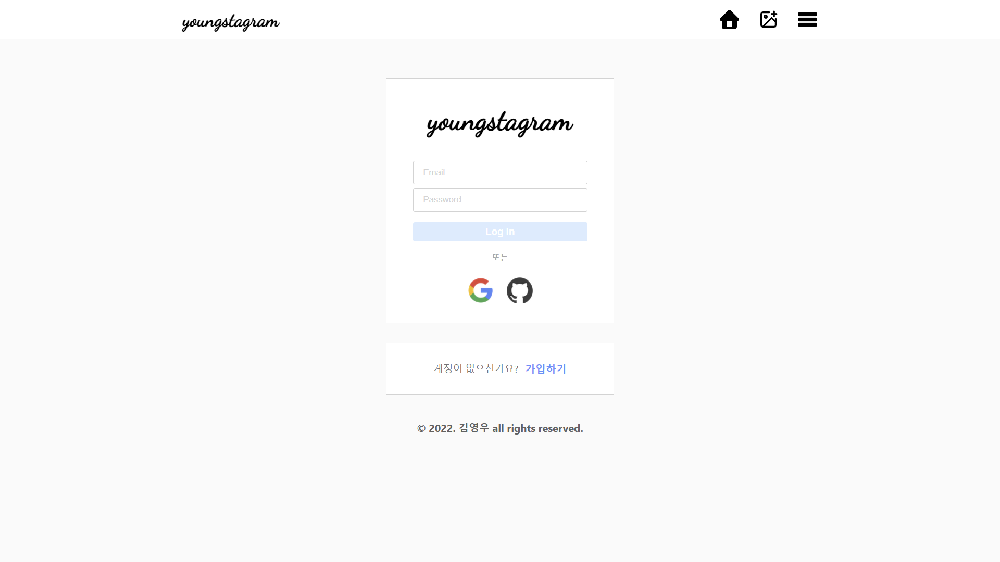
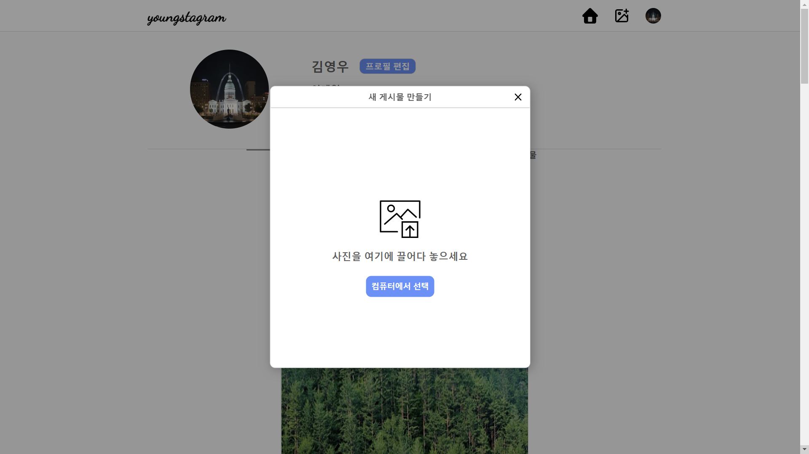
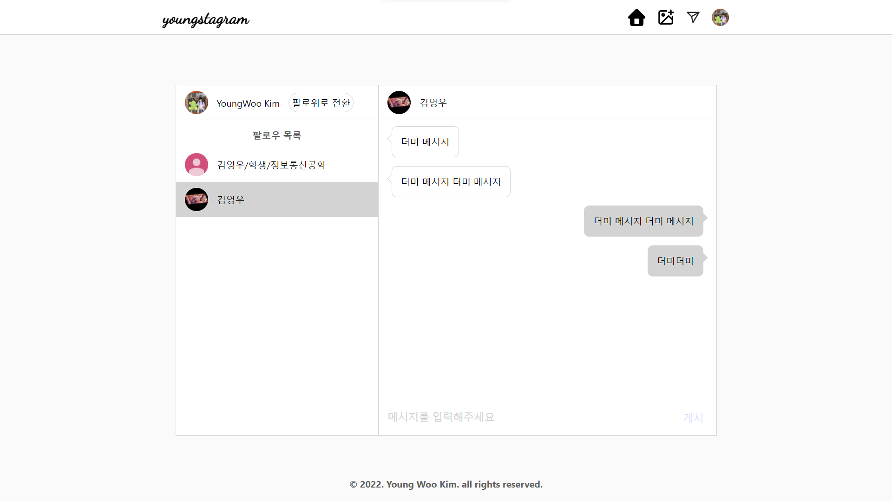
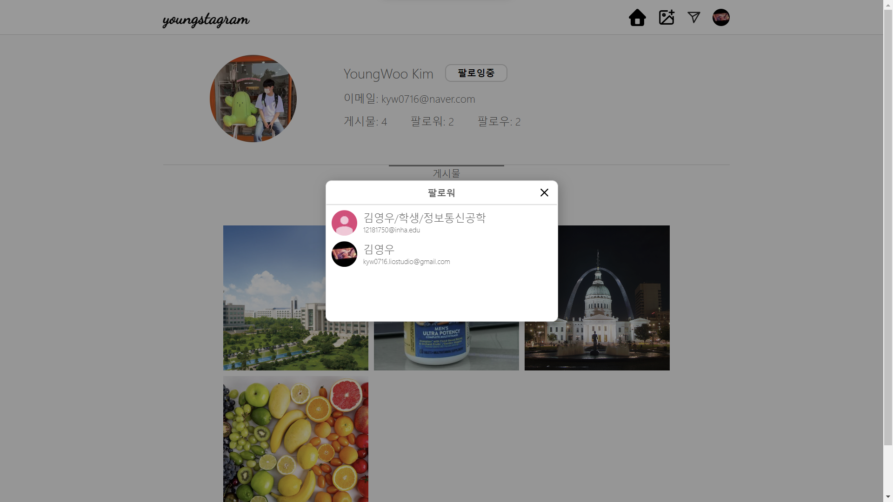
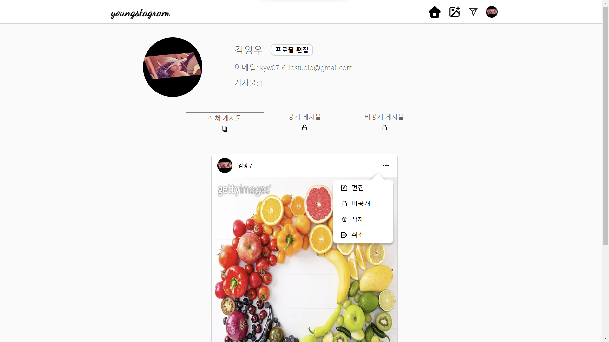
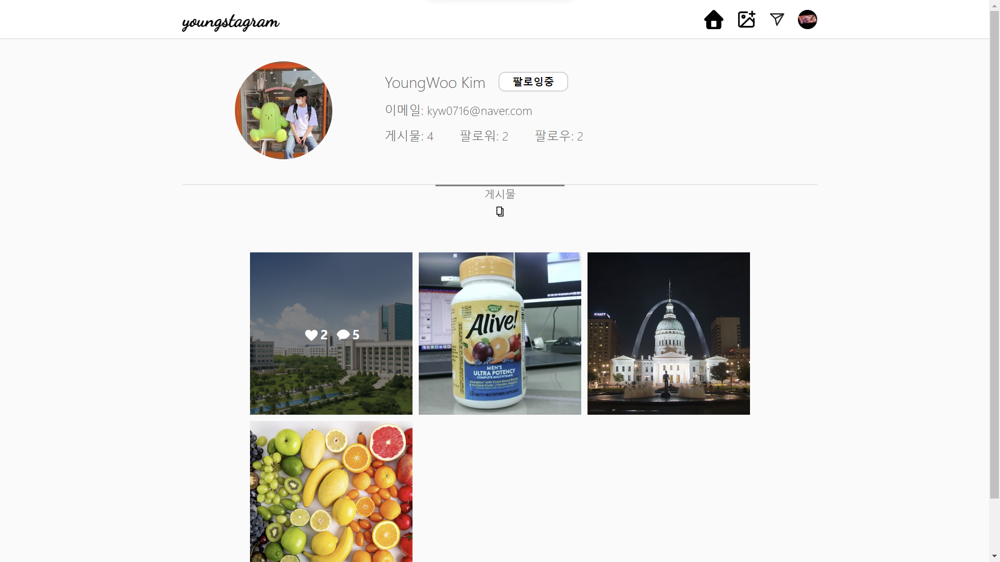
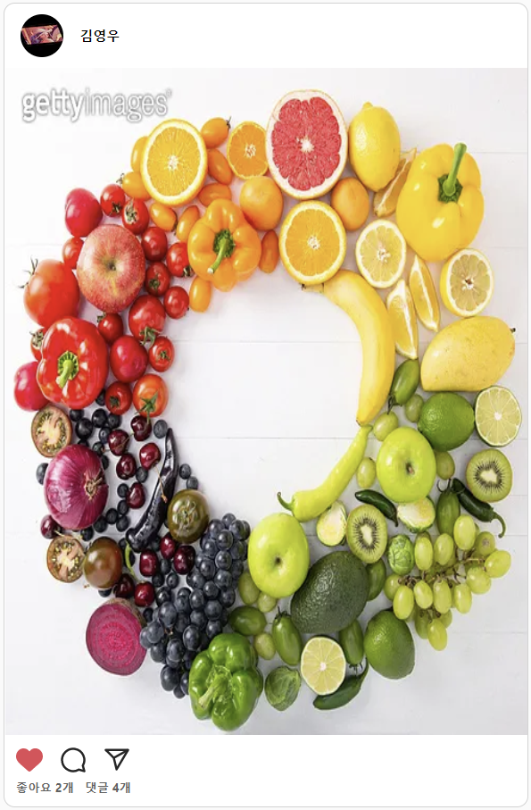
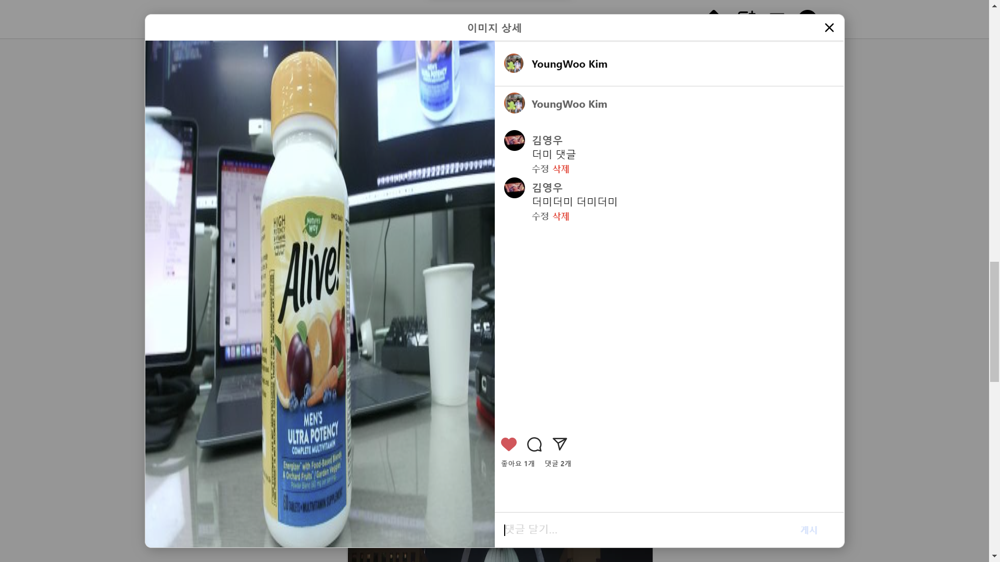

# Description

<br/>

[youngstagram](https://youngstagram-demo.vercel.app)은 typescript, react, firebase 등을 이용하여 백엔드 개발자 없이 인스타그램이 제공하는 서비스를 구현해보고자 만들었다.

- 현재까지 공부한 내용을 어떻게 활용할까 고민해보다 평소 아무 생각없이 자주 접속하던 인스타그램을 만들어보는게 어떨까 하는 생각이 들어 이 프로젝트를 시작하게 되었다.
- 그냥 겉모습만 비슷한 프로젝트가 아닌 실제로 사용할 수 있는 프로젝트를 하고 싶어 vercel을 통해 배포를 한 상태로 개발을 진행하였다.
- 혼자 진행한 프로젝트인 만큼 gitflow와 같이 복잡한 방식을 사용하지 않고 Trunk-Based Development 방식을 도입하여 개발을 진행하였다.

<br/>

# Installation

<br/>

기본적으로 node.js가 설치되어 있어야 하고, firebase 초기 설정 또한 필요하다. node.js 설치가 되어 있다면

```node.js
  npm i
```

를 입력하여 필요한 모듈들을 다운받는다.

<br/>

초기 firebase 설정을 위해 firebase-practice 폴더의 src와 같은 경로에 `FireBase.tsx` 파일을 만든 후 다음과 같이 코드를 작성한다

```typescript
import { initializeApp } from "firebase/app";
import { getAuth } from "firebase/auth";
import { getFirestore } from "firebase/firestore";
import { getStorage } from "firebase/storage";

const firebaseConfig = {
  apiKey: "",
  authDomain: "",
  projectId: "",
  storageBucket: "",
  messagingSenderId: "",
  appId: "",
};

const FireBasApp = initializeApp(firebaseConfig);
export const authService = getAuth(FireBasApp);
export const DBService = getFirestore(FireBasApp);
export const storageService = getStorage(FireBasApp);
```

여기서 firebaseConfig는 firebase 공식 홈페이지의 초기설정을 마치면 나오는 코드를 그대로 복사해 사용하면 된다.

<br/>

# Stack

- Programming Langruage:
  
  
  
  

- Framework:
  
  
  
- DataBase:
  

- Deployment:
  

- Version Control:
  
  

- IDE:
  

- Browser Support:
  
  
  
  

# Image

- 로그인 페이지 <br/>
  

- 이미지 등록 모달 <br/>
  
  

- 프로필 수정 모달 <br/>
  

- DM 페이지 <br/>
  

- 팔로우, 팔로워 리스트 모달 <br/>
  

- 내 프로필 페이지 <br/>
  

- 다른 사람 프로필 페이지 <br/>
  

- 피드 정보 카드 <br/>
  

- 피드 상세 정보 및 댓글 모달 <br/>
  
