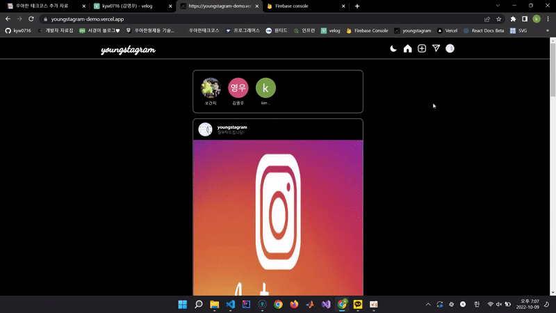

# 📌 Target

저는 다른 사람들이 혹시나 볼까 싶어 인스타그램과 같은 SNS에 사진 업로드를 잘 하지 않았습니다. 하지만 다른 사람들의 프로필에 기록된 시간들을 보며 저도 여자친구와 함께했던 시간을 기록해보고 싶다는 생각을 했습니다. 다른 사람들이 보지 못하는 둘만의 공간을 만들어 함께한 시간을 기록해보고자 프로젝트를 시작하게 되었습니다.

 
 

# 📖 Tech Stack

- Programming Langruage:
  
  
  
  

- Framework:
  
  
  
- DataBase:
  

- Deployment:
  

- Version Control:
  
  

- IDE:
  

- Browser Support:
  
  
  
  

  

# 🛠️ Feature

- 로그인 기능
- 피드 업로드 / 수정 / 삭제 기능
- 코멘트 등록 / 수정 / 삭제 기능
- 프로필 수정 기능
- DM 기능
- 팔로우 기능
- 좋아요 기능

  

# 🖥️ Deployment

### 📷 [Youngstagram](https://youngstagram-demo.vercel.app)

 

1️⃣ DM기능, 다크모드 기능

  
  

 

2️⃣ 댓글 기능, 로그인 기능

  
  

 

3️⃣ 이미지 업로드 기능, 팔로우 기능

  
  

 

4️⃣ 프로필 편집 기능

